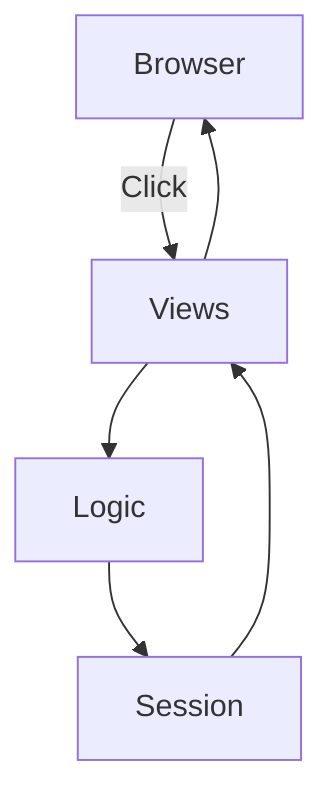
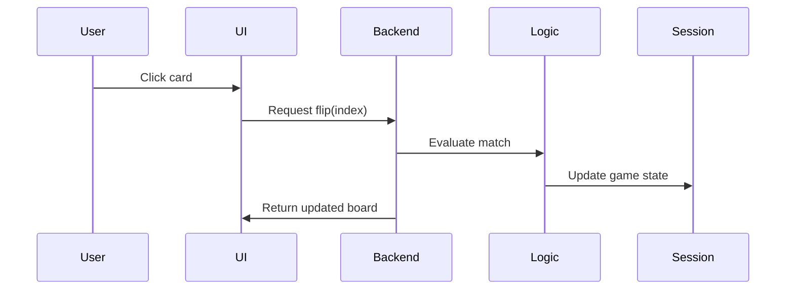
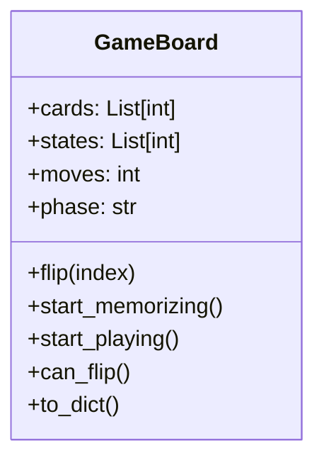

# Memory Game Web Application

This repository contains a minimal memory matching game built with **Python** and **Django**. The goal is to flip cards and find all matching pairs in as few moves as possible. The game state lives entirely in the user's session so no database is required.

## Technologies

- Python & Django
- HTML, CSS and JavaScript
- Docker & Docker Compose for containerized development

## How the Game Works

1. When the page loads, the backend creates a shuffled board of paired numbers.
2. Click **Start Memorizing** to reveal all cards for a short time.
3. Click **Start Playing** to hide the cards and begin matching pairs.
4. Clicking a card sends an AJAX request to `/flip/<index>/` where the server checks for matches and updates the session.
5. The frontend updates the board via JavaScript; mismatched cards are hidden again after a short delay.
6. When all cards are matched, a victory message is shown. You can restart at any time.

## Local Development

### Using virtualenv

```bash
python -m venv env
source env/bin/activate
pip install -r requirements.txt
python memory_project/manage.py migrate  # no-op but included for completeness
python memory_project/manage.py runserver
```

Open `http://localhost:8000/` in your browser.

### Using Docker

```bash
docker-compose up --build
```

The application will be available at `http://localhost:8000/`.

## Project Structure

```text
.
├── Dockerfile
├── docker-compose.yml
├── requirements.txt
├── memory_project
│   ├── manage.py
│   ├── db.sqlite3
│   ├── game
│   │   ├── apps.py
│   │   ├── logic.py
│   │   ├── urls.py
│   │   └── views.py
│   ├── memory_project
│   │   ├── asgi.py
│   │   ├── settings.py
│   │   ├── urls.py
│   │   └── wsgi.py
│   ├── static
│   │   ├── css
│   │   │   └── styles.css
│   │   └── js
│   │       └── game.js
│   └── templates
│       └── index.html
└── README.md
```

- **logic.py** – core game mechanics and session serialization.
- **views.py** – Django views for rendering and AJAX actions.
- **game.js** – client‑side logic and event handling.
- **styles.css** – styling for the board and controls.
- **Dockerfile / docker-compose.yml** – optional container setup.

## System Architecture



## Game Flow Sequence



## GameBoard Class Overview



## Notes for Developers

- The project currently stores the board in `request.session`. To persist games or add user accounts, integrate Django models and a database.
- Difficulty levels can be introduced by varying the number of pairs in `GameBoard.new_game()`.
- The frontend is intentionally simple; feel free to enhance animations or styling.

